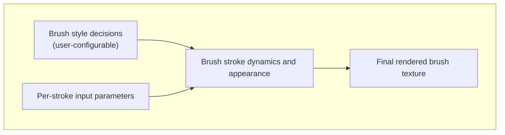
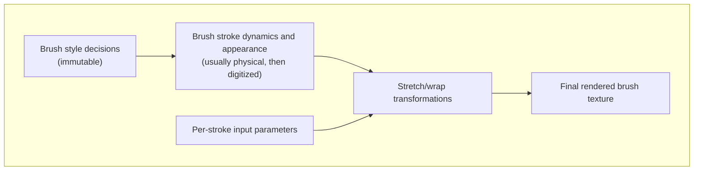
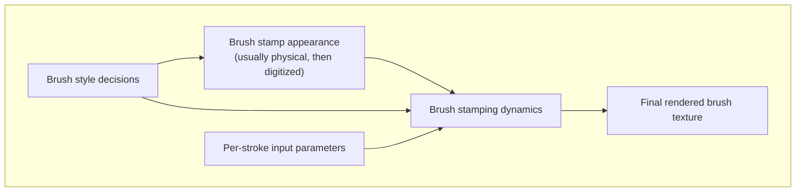
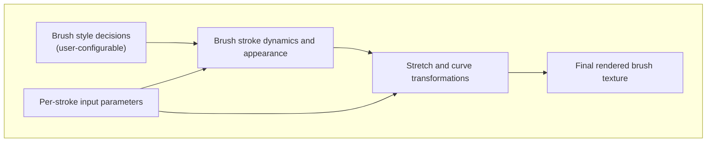
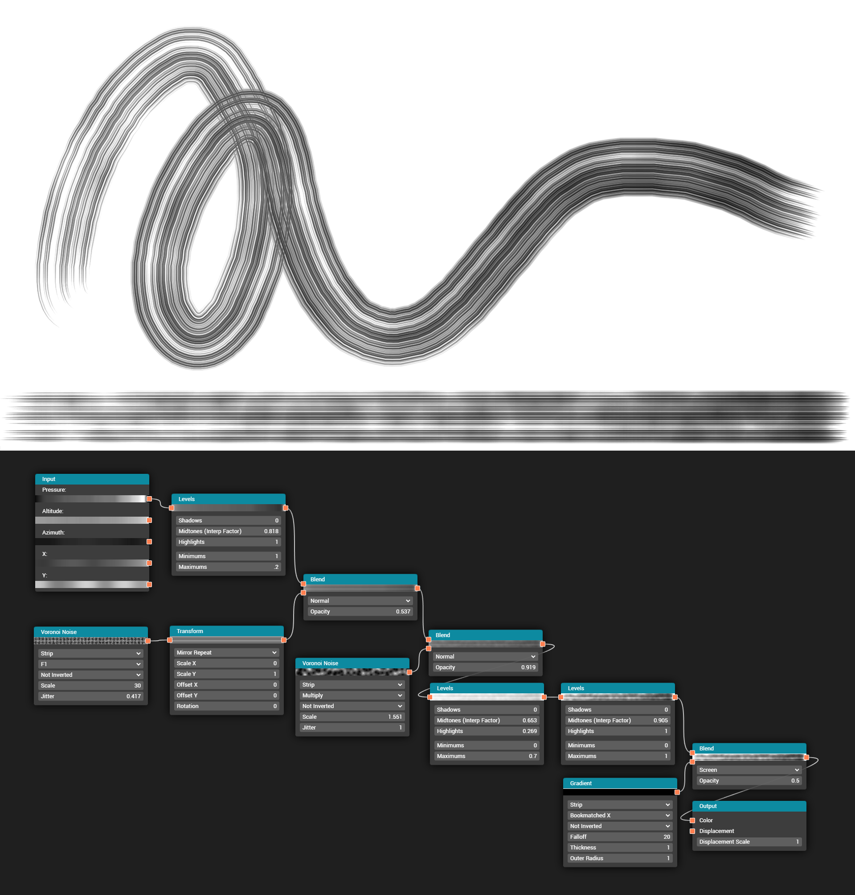
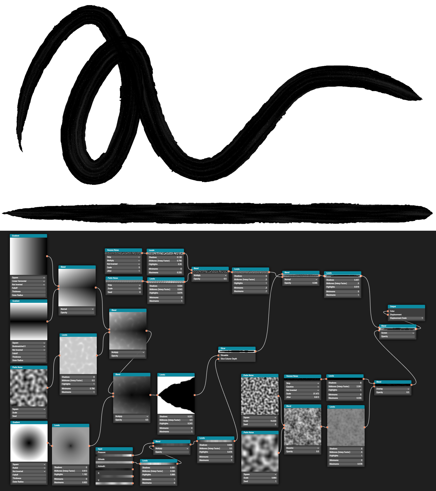
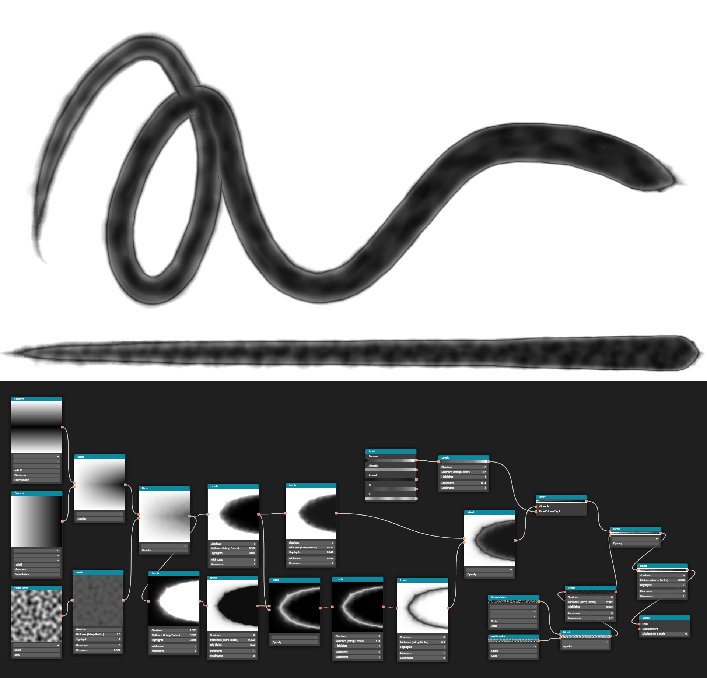
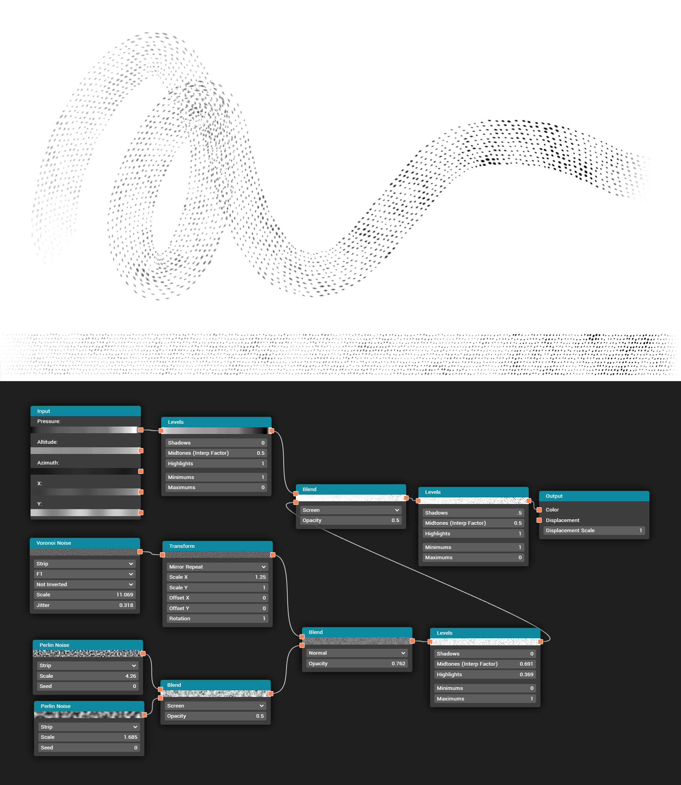

<h1>ARTIST-CONFIGURABLE NODE-BASED APPROACH TO GENERATE PROCEDURAL BRUSH STROKE TEXTURES FOR DIGITAL PAINTING</h1>

    

A Thesis
 
presented to
 
the Faculty of California Polytechnic State University,
 
San Luis Obispo

    

In Partial Fulfillment
 
of the Requirements for the Degree
 
Master of Science in Computer Science

    

by
 
Keavon Chambers
 
June 2022

---

© 2022
 
Keavon Chambers
 
ALL RIGHTS RESERVED

---

<h2>COMMITTEE MEMBERSHIP</h2>

|                   |                                                                                                               |
| ----------------: | ------------------------------------------------------------------------------------------------------------- |
|            TITLE: | Artist-Configurable Node-Based Approach to Generate Procedural Brush Stroke Textures for Digital Painting     |
|           AUTHOR: | Keavon Chambers                                                                                               |
|   DATE SUBMITTED: | June 2022                                                                                                     |
|          |                                                                                                               |
|  COMMITTEE CHAIR: | Christian Eckhardt, Ph.D. Assistant Professor of Computer Science                                          |
| COMMITTEE MEMBER: | April Marie Grow, Ph.D. Assistant Professor of Computer Science                                            |
| COMMITTEE MEMBER: | Enrica Lovaglio Costello, M.A., M.Arch. Professor of Computational Art in the Art and Design Department |

---

<h2 style="margin-bottom: 0">ABSTRACT</h2>

Artist-Configurable Node-Based Approach to Generate Procedural Brush Stroke Textures for Digital Painting

Keavon Chambers

 

Digital painting is the field of software designed to provide artists a virtual medium to emulate the experience and results of physical drawing. Several hardware and software components come together to form a whole workflow, ranging from the physical input devices, to the stroking process, to the texture content authorship. This thesis explores an artist-friendly approach to synthesize the textures that give life to digital brush strokes.

Most painting software provides a limited library of predefined brush textures. They aim to offer styles approximating physical media like paintbrushes, pencils, markers, and airbrushes. Often these are static bitmap textures that are stamped onto the canvas at repeating intervals, causing discernible repetition artifacts. When more variety is desired, artists often download commercially available brush packs that expand the library of styles. However, included and supplemental brush packs are not easily artist-customizable.

In recent years, a separate field of digital art tooling has seen the popular growth of node-based procedural content generation. 3D models, shaders, and materials are commonly authored by artists using functions that can be linked together in a visual programming environment called a node graph. In this work, the feasibility is tested of using a node graph to procedurally generate highly customizable brush textures. The system synthesizes textures that adapt to parameters like pen pressure and stretch along the full length of each brush stroke instead of stamping repetitively. The result is a more flexible and artist-friendly way to define, share, and tweak brush textures used in digital painting.

<h2>ACKNOWLEDGMENTS</h2>

Special thanks to:

- Oliver Davies, for inspiration about the Slicer node concept, code assistance, and continual encouragement

- Dennis Kobert, for help exploring ideas leading to this topic

- James Lindsay, for code assistance

---

<h2>TABLE OF CONTENTS</h2>

Page  
[LIST OF FIGURES](#list-of-figures)  
CHAPTER  
[1&nbsp;&nbsp;Introduction](#ch-1)  
[2&nbsp;&nbsp;Background](#ch-2)  
[2.1&nbsp;&nbsp;Preface: An Ideal Brush Model](#ch-2-1)  
[2.2&nbsp;&nbsp;Stretching Brush Model](#ch-2-2)  
[2.3&nbsp;&nbsp;Stamping Brush Model](#ch-2-3)  
[2.4&nbsp;&nbsp;Sweeping Brush Model](#ch-2-4)  
[2.5&nbsp;&nbsp;Simulating Brush Model](#ch-2-5)  
[2.6&nbsp;&nbsp;Synthesizing Brush Model (Proposed)](#ch-2-6)  
[3&nbsp;&nbsp;Node System](#ch-3)  
[3.1&nbsp;&nbsp;Generator Nodes](#ch-3-1)  
[3.2&nbsp;&nbsp;Modifier Nodes](#ch-3-2)  
[3.3&nbsp;&nbsp;Input and Output Nodes](#ch-3-3)  
[4&nbsp;&nbsp;Slicer Node](#ch-4)  
[5&nbsp;&nbsp;Implementation](#ch-5)  
[6&nbsp;&nbsp;Results](#ch-6)  
[6.1&nbsp;&nbsp;Flat Bristle Brush with Paint](#ch-6-1)  
[6.2&nbsp;&nbsp;Ragged-Edged Ink Brush Pen](#ch-6-2)  
[6.3&nbsp;&nbsp;Watered-Down Ink Brush](#ch-6-3)  
[6.4&nbsp;&nbsp;Dotted Stamp Roller](#ch-6-4)  
[7&nbsp;&nbsp;Conclusion](#ch-7)  
[REFERENCES](#references)

<h2>LIST OF FIGURES</h2>

FigurePage  
[1&nbsp;&nbsp;&nbsp;&nbsp;&nbsp;&nbsp;Ideal Brush Model](#fig-1)  
[2&nbsp;&nbsp;&nbsp;&nbsp;&nbsp;&nbsp;Stretching Method Brush Model](#fig-2)  
[3&nbsp;&nbsp;&nbsp;&nbsp;&nbsp;&nbsp;Brush Texture Axial Stretch Demonstration](#fig-3)  
[4&nbsp;&nbsp;&nbsp;&nbsp;&nbsp;&nbsp;Stamping Method Brush Model](#fig-4)  
[5&nbsp;&nbsp;&nbsp;&nbsp;&nbsp;&nbsp;Repetition with the Stamping Model](#fig-5)  
[6&nbsp;&nbsp;&nbsp;&nbsp;&nbsp;&nbsp;Alpha Accumulation](#fig-6)  
[7&nbsp;&nbsp;&nbsp;&nbsp;&nbsp;&nbsp;Proposed Method Brush Model](#fig-7)  
[8&nbsp;&nbsp;&nbsp;&nbsp;&nbsp;&nbsp;Gradient Nodes in Their Different Styles](#fig-8)  
[9&nbsp;&nbsp;&nbsp;&nbsp;&nbsp;&nbsp;Perlin Noise Nodes at Different Scales](#fig-9)  
[10&nbsp;&nbsp;&nbsp;&nbsp;"F1" Style Voronoi Noise](#fig-10)  
[11&nbsp;&nbsp;&nbsp;&nbsp;"F2" Style Voronoi Noise](#fig-11)  
[12&nbsp;&nbsp;&nbsp;&nbsp;"Subtract" Style Voronoi Noise](#fig-12)  
[13&nbsp;&nbsp;&nbsp;&nbsp;"Multiply" Style Voronoi Noise](#fig-13)  
[14&nbsp;&nbsp;&nbsp;&nbsp;"Divide" Style Voronoi Noise](#fig-14)  
[15&nbsp;&nbsp;&nbsp;&nbsp;"Power" Style Voronoi Noise](#fig-15)  
[16&nbsp;&nbsp;&nbsp;&nbsp;"Multilog" Style Voronoi Noise](#fig-16)  
[17&nbsp;&nbsp;&nbsp;&nbsp;"Caustics" Style Voronoi Noise](#fig-17)  
[18&nbsp;&nbsp;&nbsp;&nbsp;Blend Node](#fig-18)  
[19&nbsp;&nbsp;&nbsp;&nbsp;Levels Node](#fig-19)  
[20&nbsp;&nbsp;&nbsp;&nbsp;Transform Node](#fig-20)  
[21&nbsp;&nbsp;&nbsp;&nbsp;Input and Output Nodes](#fig-21)  
[22&nbsp;&nbsp;&nbsp;&nbsp;Slicer Node](#fig-22)  
[23&nbsp;&nbsp;&nbsp;&nbsp;Slicer Node Used for an Ink Brush](#fig-23)  
[24&nbsp;&nbsp;&nbsp;&nbsp;Results of a Flat Bristle Brush with Paint](#fig-24)  
[25&nbsp;&nbsp;&nbsp;&nbsp;Results of a Ragged-Edged Ink Brush Pen](#fig-25)  
[26&nbsp;&nbsp;&nbsp;&nbsp;Results of a Watered-Down Ink Brush](#fig-26)  
[27&nbsp;&nbsp;&nbsp;&nbsp;Results of a Dotted Stamp Roller](#fig-27)

<h2 id="ch-1">Chapter 1 INTRODUCTION</h2>

When setting out to build a 2D art tool, a component of core importance is the brush-based painting system. Existing art software offer varying capabilities ranging in levels of complexity. Some approaches work by simply stamping a texture at repeating intervals and the shape of that roughly square or circle pattern defines the look of the paintbrush. Others take a basic predefined length of a straight brushwork pattern then stretch and wrap it around the artist's brush stroke. Yet others use more sophisticated means to simulate the physics of wet media and paint mixing.

While each method has its pros and cons, a common factor is the inability to provide deep levels of artistic control over the look, feel, and interactions of a chosen brush style. This leaves artists stuck with a lack of variety and constrained in their freedom to realize their creative visions for particular artistic styles. The digital creative industry is increasingly moving towards building tooling that is art-directable, and that is an especially valuable trait for a tool so fundamental as the paintbrush.

Digital illustrations are often made by drawing with a graphics tablet where the stylus provides artists a more tactile and natural feel compared to a mouse. Furthermore, graphics tablets provide additional axes of input data including pen pressure and tilt in three axes of attitude. Many industry-standard digital painting applications like Photoshop and Krita allow users to map these input axes to chosen parameters like brush radius and opacity. Such choices are simple and understandable, but they can only loosely approximate the qualities of physical brushes, markers, pencils, and other tangible media on a real drawing surface. Pressure and tilt do not only affect the opacity and thickness of a line, but in more complex ways as well. Providing artists control over the mapping from input to output is a crucial capability for modeling diverse styles of brush textures effectively.

In the related field of 3D art, procedural texture generation is now a common workflow that solves the problem of mapping complex input parameters in nontrivial ways to a rendered output texture. The 3D industry uses 2D textures for the materials that define the coloration and lighting on the surfaces of models and environments. Usually, these are square textures that repeat seamlessly across the surfaces of walls, walkways, weapons, or wyverns in a 3D scene. Because of the large coverage that would be required to generate a texture uniquely across a sizable area like the terrain of a world, repetition helps avoid impractically large GPU memory and disk storage requirements in games. By comparison, brush paths in a digital painting are drawn along a curving line, and it is feasible to compute and store textures that scale in a single axis. Area coverage grows with the square of the edge lengths, while linear coverage only grows with the edge length. Therefore, it is practical to procedurally generate a unique texture that spans the length of every brush stroke in a painting with reasonable memory and computation demands. What remains is deciding upon exactly how to approach that procedural generation goal with the aim of being useful, flexible, and user-friendly.

The software Substance Designer is the industry standard used by 3D artists for useful, flexible, and relatively user-friendly procedural texture authorship. It acts as a toolbox for generating textures in a node graph environment where functions receive parameters then compute some derived output that the user wires into other nodes, forming a directed acyclic graph (DAG) of image processing steps. Functions are the nodes of the graph, represented by boxes, and data connections are the edges of the graph, represented as curved wires. Some nodes generate textures, like Perlin noise that employs a random seed to produce a cloud-like pattern. Others apply effects to an input texture, like Gaussian blur or exposure histogram curves. Combining generated content in clever ways results in practically any material that's imaginable by a procedural artist, representing photorealistic or stylized looks. It stands to reason that the proven power of node-based procedural texture generation can be borrowed and applied to generate stylized or photorealistic brush textures as well.

This thesis contributes a prototype workflow concept to explore the feasibility of procedural brush authorship. It examines the approach of using an artist-configurable node graph to offer maximal control over the brush customization process and finds where the strengths and weaknesses of the solution present themselves.

The paper begins by investigating the brush rendering approaches taken by existing software and related academic works for comparison with the proposed solution (chapter 2). It documents the conceptual model and user experience for artists using the proposed system (chapter 3). It introduces a concept for a specialized node dubbed a "Slicer" that is useful for turning time-series data like pen pressure or tilt into a textured strip based on some artist-defined square pattern texture (chapter 4). It discusses the implementation process for the prototype using web technologies like WebGL and covers some of the technical considerations in generating textures of unbounded, user-defined length in real time (chapter 5). It evaluates the results of attempting to replicate specific choices of brush styles inspired by physical art media and online reference pictures (chapter 6). And it concludes by discussing future improvements and applications of the technique (chapter 7).

---

<h2 id="ch-2">Chapter 2 BACKGROUND</h2>

Digital artists have a wide range of choices for painting software and each tool specializes in different strengths and styles. Vector graphics applications like Adobe Illustrator and Affinity Designer offer approaches that center around their curve-based art representation. Raster graphics editors like Adobe Photoshop, Krita, and Procreate center their solutions around their layer and pixel-based nature. Specialized paint simulation software like Corel Painter and Adobe Fresco focus on simulation of wet media and paint mixing. These different approaches present varying opportunities and drawbacks for artists depending on their preferences, art styles, and skill areas. The differences between different common brush models, which by happenstance all begin with the letter "S", are compared in this section.

<h3 id="ch-2-1">2.1 Preface: An Ideal Brush Model</h3>

To form a mental model about the process of digital painting for comparison with common approaches, here is a high-level description of the pieces at play. Figure 1 shows how these different components produce a final rendered brush texture.

Figure 1: An ideal brush model, representing real life painting or sophisticated digital painting systems.

The first component in the model is the configurable brush style decisions that represent how to simulate and render the brush. There is no single way to define this, but it should provide plentiful flexibility to define how any multitude of styles should look, interact, and behave so as to replicate all ranges of both real and imagined art media. It should also be highly customizable without requiring artists to create and digitize new physical textures or modify code.

The second component in the model is the input data. Based on user interactions with input device hardware and settings in the software, this represents the parameters that change with every unique stroke. Even using the same brush configuration, these values can differ every time something is drawn. Common values are listed below, although more are possible and others like "speed" or "curvature" can be derived from them.

At each sample along the path:

- X and Y coordinates
- Pen pressure (optional)
- Pen tilt, in up to three axes (optional)
- Timestamp (optional)

Possible properties that usually are set once per stroke:

- Standard stroke width
- Color

The third component in the model is the brush engine which simulates and renders a textured brush stroke, given the previous two components as input. The result is a texture that integrates style decisions with the path-specific parameters and curves with the paintbrush motion. In real life, this "brush engine" is just the physics of the media interacting with the drawing surface. In the digital world, this is a physics and/or rendering engine which computes what is necessary to model or approximate the real life interactions as best as possible. Many practical approaches use brush patterns scanned from real life to achieve realistic-looking results without the complexity and difficulty of a high-fidelity simulation.

<h3 id="ch-2-2">2.2 Stretching Brush Model</h3>

Popular among vector graphics editors, stretching is a method of rendering brush textures around a curved drawing path. In this model, as broken down in Figure 2, brush styles take the form of long and thin images of brush strokes drawn in a straight line. These texture strips are then wrapped around the curving trajectory of each brush stroke drawn by the artist.

Figure 2: With the stretching method, style decisions occur before the brush is rendered and per-stroke inputs are applied afterward.

Usually texture strips are authored by using real art media to draw a straight line of a certain length, then scanning or photographing the image to digitize it as a texture or detailed vector shape. Since they are based on real brushes, this approach can often look very good in places where its lack of flexibility is not a major constraint.

The drawbacks of this approach mainly center around its static, non-adaptive nature. It is the brush equivalent to authoring 3D material textures by capturing real-world photos of surfaces— highly realistic but not very customizable after-the-fact. It also means that the uniqueness of multiple strokes using the same texture may become apparent with noticeable duplication of the pattern throughout the artwork. Because brush texture strips are created beforehand, the at-time-of-usage properties like stroke length, chosen stroke width, and localized pressure/tilt cannot be factored into the original texture source.

Figure 3: Brush texture axial stretch demonstration in Adobe Illustrator (top) and Affinity Designer (bottom) where the same texture visibly repeats and deviates from its authored aspect ratio.

To work with arbitrary stroke widths and lengths, the aspect ratio of the texture will end up being stretched, as shown in Figure 3. To wrap the straight texture around a curving stroke path, more stretching is necessary where tight turns will compress inner radii and stretch outer radii. To integrate pressure or tilt data, users may be able to choose a mapping from those parameters into rendering modifiers like opacity or localized stroke width "pucker". These transformations take a beautiful input texture and reduce its perceived quality, somewhat diminishing the overall utility of the stretching brush model.

<h3 id="ch-2-3">2.3 Stamping Brush Model</h3>

Popular among raster graphics editors, stamping is perhaps the most common approach used in mainstream digital painting software. The method takes a texture of roughly square or circular proportions (not a long strip) and repeatedly stamps that image onto the drawing layer along the trajectory of the brush path. The model is described in Figure 4.

By avoiding the need to stretch the textures, many of the drawbacks in the stretching brush model can be avoided. The approach is largely a practical compromise between that model and the ideal brush model, which explains its prevalence in the industry. Stamping is more flexible at following arbitrary paths, especially ones with sharp bends. A larger degree of tailored behavior can be implemented and made configurable to vary the stamping algorithm and increase visual variety, achieve different styles, and factor in parameters like pen pressure and tilt.

Figure 4: With the stamping method, style decisions by the author of a brush take the form of a stamp texture and custom settings for the stamping system that applies brush dynamics and other configurable tricks to lend variety and quality to the result.

The approach does come with its own share of disadvantages. The illusion can often be broken when the repetitiveness of the stamp texture becomes apparent, as shown in the Krita painting application in Figure 5. Randomization of rotation and countless other tricks can be used to break up the repetition with the stamping algorithm, however these strategies need to be configured for each brush style, thereby adding complexity to the user experience. By its nature of stamping down textures, it works better at modeling the look of dry more than wet media. Another drawback is that, while the stamping dynamics settings can be modified on a brush style preset by the user, the texture (which is often digitized from a physical pattern) is not so easily reconfigurable.

Figure 5: Noticeable repetition is visible in many cases with the stamping model, as shown here in Krita.

Figure 6: Alpha accumulation and repetition is a tradeoff based on the choice of spacing distance. The circular brushes have 100% feather on the left and 0% on the right. The top row uses 1% spacing, the middle row 25%, and the bottom row 50%.

One further limitation of stamping is how the discrete nature of individual stamps, spaced at a chosen distance interval, leads to an undesirable phenomenon called alpha accumulation. This is where the translucent pixels in a stamp that mostly overlaps itself will add up to become more opaque, reducing the intended translucency that is desired. To reduce the alpha accumulation, a wider spacing interval can be set so fewer stamps overlap each other, but then the discrete repetition becomes more obvious. Figure 6 shows how variations in spacing affect the alpha accumulation and obviousness of separate stamps for simple feathered circular brushes.

<h3 id="ch-2-4">2.4 Sweeping Brush Model</h3>

In response to the discrete nature of stamping, a proposed variation is the brush sweeping model. Rather than placing the stamp texture at a repeating interval, it smears the texture across the stroke trajectory. The differences between sweeping and stroking are discussed in Chapter 2: A Brush Stroke Synthesis Toolbox[[1]](#ref-1) of _Image and Video-Based Artistic Stylisation_ by Paul Rosin and John Collomosse.

A modern implementation[[2]](#ref-2) uses integral calculus to analytically determine the pixel fill opacity in the rendering process efficiently on the GPU.

Sweeping is not widely used in painting software because it only works robustly with feathered circular brushes. Textures, like those frequently used in stamping, are not easily integrated in the 2D plane.

<h3 id="ch-2-5">2.5 Simulating Brush Model</h3>

Some painting applications like Corel Painter and Adobe Fresco use more sophisticated simulation-based methods to provide a painting experience that better models physical painting, especially with wet media.

Commercial software and research implementations[[3]](#ref-3) [[4]](#ref-4) [[5]](#ref-5) usually focus on modeling the brush bristles,[[6]](#ref-6) [[7]](#ref-7) fluid dynamics,[[8]](#ref-8) and pigment transfer and mixing.[[9]](#ref-9)

Primary drawbacks include performance concerns, complexity, and specialization that makes it difficult to integrate with other brush models or styles. This category of varied methodologies is mentioned for completeness but not surveyed in depth here.

<h3 id="ch-2-6">2.6 Synthesizing Brush Model (Proposed)</h3>

Procedural brush texture strip generation is a new brush model approach explored in this paper. It is based primarily off the stretching brush model described in section 2.2 but aims to provide a high degree of customization where that model provided none. Its breakdown in Figure 7 shows how it takes the stretching concept from that model but is otherwise essentially the ideal brush model.

Figure 7: The proposed method provides full dynamics and appearance control to the user based on input data, then stretches the resulting texture strip like the texture stretching brush model. This is the ideal brush model but with the insertion of the "Stretch and curve transformations" step.

Instead of using physical art media to create, then digitize, a single specimen of a straight textured stroke, the author of a brush style utilizes a node graph to procedurally generate the paint stroke style. The resulting node setup acts as the "source code" implementing the brush style decisions made by its author, and that can be modified by any user later on.

Because brush texture strips are created while painting at runtime, the at-time-of-usage properties like stroke length, chosen stroke width, and localized pressure/tilt can be factored directly into the look and style of the texture source. The predefined length of a digitized strip texture using the conventional model is no longer a concern when the procedural system can generate the correct length to match the brush path's arc length. By varying the seed used in the procedural noise patterns that contribute to the look of the brush, each separate brush stroke in a drawing can look entirely unique so no repetition is observed. Aside from stroke self-intersection and stretch at areas of sharp curvature described in the stretching brush model section, this approach solves nearly all the drawbacks with that model.

---

<h2 id="ch-3">Chapter 3 NODE SYSTEM</h2>

The node graph is an interface where a brush author may combine nodes in arbitrary ways to generate custom styles. Nodes are artist-friendly boxes with settings, inputs, and outputs that provide an abstraction over code and GPU shaders to perform some visual operation like generating a procedural texture or modifying a texture in some way. Textures can be linked together with wires between an output port from one node and an input port on another node.

There are several types of nodes that are described in the sections below, many of which may look familiar to users of node-based material or shader editors. Nodes can be configured to output a Square or Strip, which specifies that the dimensions are either 1:1 or a wide rectangle that would extend as the artist draws a longer and longer brush stroke. The Slicer node, which slices square textures into strip textures, is a new concept introduced in this body of research. It is presented in greater detail in the next chapter.

<h3 id="ch-3-1">3.1 Generator Nodes</h3>

The Gradient node generates a white-to-black gradient. Its available style choices, pictured in Figure 8, include "Linear Horizontal", "Linear Vertical", "Bookmatched X", "Bookmatched Y", and "Radial". An "Invert" setting can reverse the direction of black and white. "Falloff" and "Thickness" affect the ramp of the gradient and "Outer Radius" affects the size of the radial gradient's circular reach. Like all nodes that produce a texture, the orange dot acts as the output for what is shown in the node's thumbnail.

Figure 8: Gradient nodes in their different styles.

The Perlin Noise node generates a randomized cloud pattern. Its scale can be chosen, as shown in Figure 9, to provide different frequencies of noise as desired, and regardless of scale the texture will tile seamlessly along its edges. Its seed can be set to provide a new random pattern.

Figure 9: Perlin Noise nodes at different scales.

The Voronoi Noise node generates a randomized cellular structure. Different jitter values between 0 and 1 can provide a choice of regularity or disorder. Eight choices of style can produce a diverse array of looks to suit the artist's needs. These are "F1" (Figure 10), "F2" (Figure 11), "Subtract" (Figure 12), "Multiply" (Figure 13), "Divide" (Figure 14), "Power" (Figure 15), "Multilog" (Figure 16), and "Caustics" (Figure 17). These styles are implemented taking a grid of points, randomizing their offset based on the jitter value, and calculating the distance of each pixel to the nearest point for the F1 value and the distance to the second-nearest point for the F2 value. Additional styles are created by arithmetically combining F1 and F2 as described in the captions in the figures below.

Figure 10: Voronoi Noise nodes at different jitter values with the "F1" style.

Figure 11: Voronoi Noise nodes at different jitter values with the "F2" style.

Figure 12: Voronoi Noise nodes at different jitter values with the "Subtract" style, which is calculated in GLSL as `F2 - F1`.

Figure 13: Voronoi Noise nodes at different jitter values with the "Multiply" style, which is calculated in GLSL as `F1 * F2`.

Figure 14: Voronoi Noise nodes at different jitter values with the "Divide" style, which is calculated in GLSL as `F1 / F2`.

Figure 15: Voronoi Noise nodes at different jitter values with the "Power" style, which is calculated in GLSL as `pow(F2, F1)`.

Figure 16: Voronoi Noise nodes at different jitter values with the "Multilog" style, which is calculated in GLSL as `log(F1) * log(F2)`.

Figure 17: Voronoi Noise nodes at different jitter values with the "Caustics" style, which is calculated in GLSL as `log(log(F1) * log(F2))`.

<h3 id="ch-3-2">3.2 Modifier Nodes</h3>

The Blend node takes two input textures and composites them as a single output. Two examples are shown in Figure 18. The blend mode can be selected between "Normal", "Dissolve", "Multiply", "Screen", "Add (Linear Dodge)", "Overlay", and "Subtract" which uses the industry-standard compositing blend equations. Opacity can be set to favor the top or bottom input more in the "Normal", "Dissolve", and "Overlay" modes while it has no effect on the others in this implementation.

Figure 18: Blend node used in two example compositing scenarios.

The Levels node takes a texture and clamps its light and dark regions as specified. Three examples are shown in Figure 19. "Shadows" and "Highlights" clamps the dark and light parts of the image, making anything beyond the specified values either pure black or pure white. "Midtones (Interp Factor)" biases the gray levels towards clamped white or black areas. "Minimums" and "Maximums" caps the darkest and lightest parts of the texture at some gray level.

Figure 19: Levels node shown in three example usage scenarios.

The Transform node takes a texture and modifies its scale, offset position, and rotation. Two examples are shown in Figure 20. It can be configured to repeat, mirror repeat, and clamp when the input texture bounds are exceeded. When rotating, the exposed corners can be configured to have the colors clamped if desired.

Figure 20: Transform node shown in two example usage scenarios.

<h3 id="ch-3-3">3.3 Input and Output Nodes</h3>

The Input and Output nodes are the defaults provided in a fresh node graph, as pictured in Figure 21. These two nodes cannot be deleted or duplicated.

Figure 21: Input and Output nodes with the pressure samples connected to the brush output.

The Input node provides several strips of stroke input data from the stylus axes including pressure, tilt altitude (angle from parallel to normal with the screen), tilt azimuth (angle clockwise from the +X axis), and X and Y positions on the page (increasing from the top left). Each ranges from 0 (black) to 1 (white). While the X and Y positions are provided for completeness, they are unlikely to be useful directly in the procedural texture authorship process; they are more useful in the stroke wrapping stage which is not in the scope of this prototype implementation.

The Output node is the destination for node graph data. When a strip texture is plugged into the Color field, the magnified result is previewed along the full width of the application below the node graph. When a square texture is plugged into the "Color" and/or "Displacement" field, the magnified result is previewed along the right side of the application. The displacement, when connected, also renders the texture on a spinning 3D plane with a perturbed height matching the dark (low) and light (high) parts of the provided texture. "Displacement Scale" multiplies the height by a chosen factor. While displacement is not directly involved in the final brush texture, it is a useful tool to visualize square textures in the third dimension while working. Often square textures are sampled by other nodes in the graph in a way that represents height or intensity information and this features makes those cases easier to conceptualize.

---

<h2 id="ch-4">Chapter 4 SLICER NODE</h2>

The Slicer node is an important node designed to convert from square textures into strip textures, demonstrated in Figure 22. Squares are useful to work with because their aspect ratio makes them easy to preview, and it is thus desirable to rely on them for many of the creative decisions that go into building a node graph out of generators and modifiers.

Figure 22: Slicer node rendering vertical cross-sections of an upward-slanted blob shape, showing how the increase then decrease in pen pressure rides the slant up then back down by the end as pressure subsides to 0 (black).

One example of a common use for the Slicer is to define the way that a brush tapers with an increase in stylus pressure or tilt angles. A more involved example of this concept in Figure 23 approximates the brush pressure contour part of a semi-diluted ink brush.

Figure 23: Slicer node used to generate the pressure-based taper for an ink brush with partially diluted ink.

The node's two inputs are the "Sliceable" square texture and the "Slice Column Depth" strip texture. The sliceable texture should be designed in a way that its vertical cross sections (columns of pixels) vary on a continuum from left to right. For example, a left-pointing triangle has cross sections that heighten from left to right which makes it great for modeling pen pressure along the brush stroke. Described another way, the Slicer node maps the columns of the input strip texture to the columns of the input square texture, where the brightness of the strip column corresponds to how far right the slice should be taken from the sliceable. Reading an input strip from left to right, the dark shades slice columns from the left parts of the sliceable and the light shades slice from the right parts.

The description of the Slicer node's function may be confusing upon initial introduction but it becomes intuitive to reason about after a brief period of usage. It therefore serves as a useful artist-friendly tool in the node graph system's toolbox of nodes, whereas a more complex stroke generating method could be difficult enough to limit its utility.

The concept of mapping slices from square into strip textures in a user-friendly manner for the purpose of brush stroke generation is a technique contributed by this body of research as a novel part of the larger system design.

---

<h2 id="ch-5">Chapter 5 IMPLEMENTATION</h2>

The aim of the research conducted in this thesis is to explore the feasibility of the proposed brush authorship approach. Ergo, the implementation is not the main focus of this work, but some details are covered in this section for the sake of completeness. The reference implementation is foremost a prototype and not meant to provide production levels of robustness, efficiency, and user comforts. Those concerns lie outside the scope of this work, which focuses on proving the technique itself. The final chapter references future plans for the implementation of the concepts stemming from this research in a production-ready graphics editor application.

In order to explore the technique and iterate rapidly, a flexible node graph system was required. A barebones node graph library previously built by the thesis author was used as the groundwork for the graphical user interface and shader composition, upon which many purpose-built systems and nodes were written to power the needs of the brush synthesis use case. Specific encountered challenges included handling intermixed texture aspect ratios, recording and importing brush axis input samples, correctly displaying enlarged Output node renderings, designing and building the Slicer node, and filling in the gaps with utility nodes most necessary for a useful brush authorship experience.

Web technologies were used for the software stack in this experimental implementation. These proved to be ideal for rapid prototyping with an inherently visual technology.

HTML and CSS provide a robust and flexible GUI system, so nodes are created from HTML elements containing form inputs abstracted into a system of reusable widgets, like labels, dropdown boxes, number fields, thumbnail textures, and spacers. Upon these, abstracted input and output data connectors are mountable where relevant to the design of a particular node.

Rendering of the textures within nodes is performed by JavaScript's WebGL 2 API which extends multiplatform support to all modern web browsers. WebGL calls send texture buffers between nodes and upload new user-configured input values as uniforms to the shaders. Each node (except Input and Output) has its own shader written as part of its implementation. The process of authoring a new node is modular, requiring only a new shader and JavaScript file that provides the widget definitions and housekeeping work.

Enlarged previews of the Output textures use additional shader programs written outside the node system. The 2D views for the square and strip textures, along the right and bottom sides respectively, render a texture on a quad set to the correct aspect ratio in their vertex shaders. The spinning 3D quad is similar but uses a highly subdivided mesh where the displacement map is evaluated in the vertex shader to adjust the height of each vertex.

The brush squiggle preview uses an imported OBJ triangle strip mesh with UV maps created in Blender from an imported SVG with the recorded X and Y coordinates. The recording of the pen pressure was performed using a pen tablet and the JavaScript Pointer API. Its data was written to a JSON file that is read at runtime by the node graph to provide the strips of sample data.

A descoped feature would have included an additional preview view with an interactive stroke drawing input. This would convert the trajectory path into a triangle strip at the set stroke width with UV coordinates mapping progressively along a strip texture. The live pressure, altitude, azimuth, X, and Y values would feed into the Input node textures while the user draws and the node graph would recompute the drawing to provide a texture to the Output for display on the triangle strip. If the user kept drawing for long enough to overrun the width of the strip texture, it would be doubled in width. Alternatively, a 3D texture could be employed where additional depth layers could hold the overflow. An opportunity for performance gains would come from not re-rendering the full output texture from the node graph, because the sampled information at earlier points along the stroke path do not change and therefore would not need to be redrawn. The prototype implementation does not encounter this because its lacks a temporal element that occurs during an interactive drawing session.

The full source code for the prototype may be viewed at:

https://github.com/Keavon/Brush-Nodes

An interactive demo is also available from that page.

---

<h2 id="ch-6">Chapter 6 RESULTS</h2>

Brush authorship is inherently a creative, artistic process. That journey begins by looking at reference imagery of a certain brush style from real life or other software with the intention of replicating its look. Then, the different conceptual components are broken down and replicated in an arm of the node graph, then each are combined with each other to produce a result. It is also a highly iterative process and ideas that don't work are replaced with new ones, with constant parameter tweaking as well.

If all goes well, the result should resemble the reference imagery in style. It isn't possible to create a facsimile replica but the aim is to produce a brush style with an equivalent look and feel. This is naturally subjective, but when the brush is only a small part of the many strokes that make up a full work of art, tiny imperfections end up becoming insignificant in terms of overall utility.

This section explores several example brushes created to push the boundaries in different stylistic directions.

<h3 id="ch-6-1">6.1 Flat Bristle Brush with Paint</h3>

Brushes with more viscous media like paint, as opposed to ink or watercolor, tend to show the bristles of the brush and transfer paint to more of the page when added pressure is applied because there is greater contact with the geometry of the many bristles against the surface.

This example, shown in Figure 24, achieves the goal of replicating the overall look of an assortment of reference images found through an online search. It also manages to avoid an overly complex node graph, meaning it is simple for non-advanced users to create and there is still plenty of room to add further levels of detail and sophistication as desired.

Figure 24: Results emulating a flat bristle brush with paint.

  

<h3 id="ch-6-2">6.2 Ragged-Edged Ink Brush Pen</h3>

A brush pen with a vividly black ink provides almost a completely solid appearance except for the taper and the ragged edges, caused by the paper's small-scale surface geometry and the brush tip. Replicating that look around the edges is the goal for this test, shown in Figure 25. The system handles ink-based brushes very well which other brush models like stamping often struggle with.

Figure 25: Results emulating a ragged-edged ink brush pen.

<h3 id="ch-6-3">6.3 Watered-Down Ink Brush</h3>

Taking the ink brush style even further, this test proves the effective ability to replicate the look of watered-down ink which behaves in nontrivial ways. Painting areas of a dry page makes the wet areas store water in a tapered dome-like shape because of surface tension, causing the ink particles to dry onto the page quickest near the edges as the wet area contracts during the drying process. This leaves behind a darker perimeter where the extents of the brushed area wet the page, then an inner region where the ink flows in unique patterns of greater concentration within the blob of water. This test, shown in Figure 26, illustrates that procedural generation based on noise textures lends itself very well to emulating that phenomenon. All other brush models besides simulation are incapable of achieving a similar look. The brush preview in this case looks remarkably photorealistic.

Figure 26: Results emulating a watered-down ink brush.

<h3 id="ch-6-4">6.4 Dotted Stamp Roller</h3>

Deviating from the category of brushes alltogether and using an alternate application method such as a roller is a good method of testing robustness of the technique. This example, shown in Figure 27, successfully provides an organic look by integrating random variation and pressure into the semi-regular grid pattern of the referenced style. This also remains simple and beginner-friendly by using only a handful of nodes.

Figure 27: Results emulating a dotted stamp roller.

---

<h2 id="ch-7">Chapter 7 CONCLUSION</h2>

The stress tests attempted in the previous chapter lend credence to the viability of the novel method proposed in this paper. Wet media is especially challenging to replicate using the common stamping brush model and the sample works demonstrate that the technique performs well in that area.

Future improvements to the system should revolve around adding to the library of available nodes to simplify and expand the capabilities. Other brush models like stamping and sweeping are actually compatible with the node-based workflow and would take the form of nodes. To improve support for dry media, a stamp node could take a square texture and draw it at repeating intervals based on an assortment of parameters to output a strip texture. Other desirable nodes would be one that tapers an input strip texture based on the brightness values encoded in a second input strip. More useful data from the Output texture would be speed, since physical paint brushes often get lighter with quick motion, and a factor encoding brush angle in relation to the direction of brush motion. These improvements would make the system easier to use and more powerful at building complex and highly reactive brush styles. Another improvement would be the inclusion of color which could even vary with properties like pressure or tilt.

A direction for further research on the subject beyond the concepts explored here could find solutions for the limitations of texture stretching. Dealing with clean stretching around sharp curve bends would be valuable. A related topic can aim to solve the start and end points of stroke paths which may end abruptly if the stroke data and node graph do not provide for clean ends. Another topic can look to find the best approach for dealing with a self-intersecting stroke where the texture runs through itself and needs to blend nicely or even interact with itself in a procedurally defined way. Another challenge involves finding a way to shorten or lengthen a curve on its interior by modifying the path geometry without causing the texture on one end to "slide" along the existing geometry with the length change. One more is finding a comprehensible manner to use 3D noise textures to prevent the "bookmatched" or pixelated look of the Slicer node so the extra dimension is always providing fresh imagery.

The concept of applying a node graph procedural authoring environment, with application-specific nodes (like Slicer) designed for dealing with both square and strip textures, is clearly a worthwhile technique for digital painting research and real world painting tools to adopt. It moves towards, and nearly reaches, the ideal brush model that provides artists with full customization and integration of pen tablet axis inputs. The novel method presented in this paper improves upon unsolved problems in the approaches used by popular graphics editing tools and would be a welcome addition to future 2D painting applications.

The author of this thesis is the creator of a node-based 2D graphics editing tool and plans to use this concept as inspiration for the application's painting system. Further information can be found at the project's website:

https://graphite.rs

---

<h2 id="references">REFERENCES</h2>

[1]&nbsp;&nbsp;&nbsp;&nbsp;S. DiVerdi, “A Brush Stroke Synthesis Toolbox,” in Image and Video-Based Artistic Stylisation, P. Rosin and J. Collomosse, Eds. London: Springer London, 2013, pp. 23–44.

[2]&nbsp;&nbsp;&nbsp;&nbsp;A. Joshi, “Efficient Rendering of Linear Brush Strokes,” Journal of Computer Graphics Techniques (JCGT), vol. 7, no. 1, pp. 1–16, Feb. 2018.

[3]&nbsp;&nbsp;&nbsp;&nbsp;Z. Chen, B. Kim, D. Ito, and H. Wang, “Wetbrush: GPU-Based 3D Painting Simulation at the Bristle Level,” ACM Trans. Graph., vol. 34, no. 6, Oct. 2015.

[4]&nbsp;&nbsp;&nbsp;&nbsp;T. Stuyck, F. Da, S. Hadap, and P. Dutré, “Real-Time Oil Painting on Mobile Hardware,” Computer Graphics Forum, vol. 36, no. 8, pp. 69–79, 2017.

[5]&nbsp;&nbsp;&nbsp;&nbsp;R. Wu, Z. Chen, Z. Wang, J. Yang, and S. Marschner, “Brush Stroke Synthesis with a Generative Adversarial Network Driven by Physically Based Simulation,” in Proceedings of the Joint Symposium on Computational Aesthetics and Sketch-Based rfaces and Modeling and Non-Photorealistic Animation and Rendering, 2018.

[6]&nbsp;&nbsp;&nbsp;&nbsp;S. DiVerdi, A. Krishnaswamy, and S. Hadap, “Industrial-Strength Painting with a Virtual Bristle Brush,” in Proceedings of the 17th ACM Symposium on Virtual Reality Software and Technology, 2010, pp. 119–126.

 

[7]&nbsp;&nbsp;&nbsp;&nbsp;L. Huang, Z.-X. Hou, Y.-H. Zhao, and D.-J. Zhang, “Research progress on and prospects for virtual brush modeling in digital calligraphy and painting,” Frontiers of Information Technology & Electronic Engineering, vol. 20, no. 10, pp. –1321, Oct. 2019.

[8]&nbsp;&nbsp;&nbsp;&nbsp;P. M. O’Brien, “A framework for digital watercolor,” Texas A&M University, 2008.

[9]&nbsp;&nbsp;&nbsp;&nbsp;Š. Sochorová and O. Jamriška, “Practical Pigment Mixing for Digital Painting,” ACM Trans. Graph., vol. 40, no. 6, Dec. 2021.

